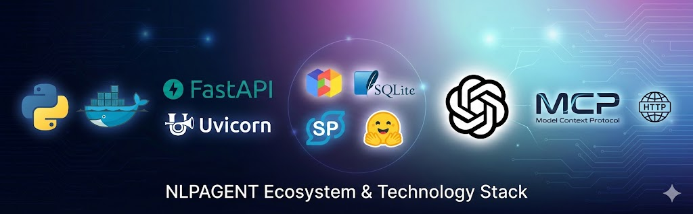
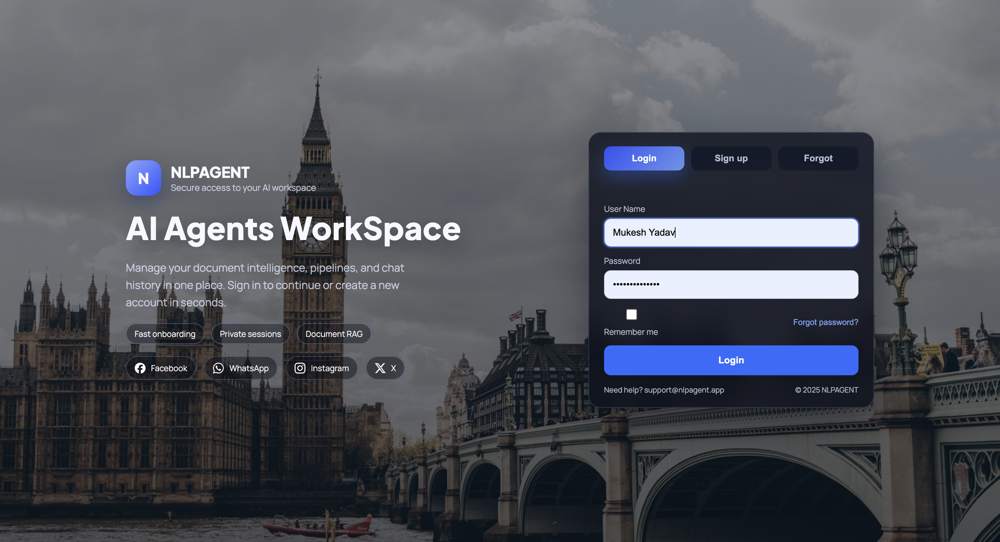
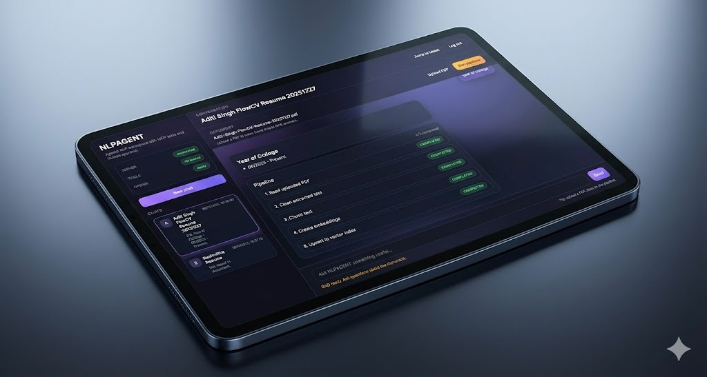

# NLPAGENT — OpenAI Brain + MCP Tools + Human Approval 
## Developer -> Mukesh Yadav Bengaluru


### NLPAGENT is a runnable reference implementation of your **Agentic NLP Ecosystem** with:

- ✅ **OpenAI LLM as the Brain**
- ✅ **ChatGPT-like UI** (FastAPI + custom frontend)
- ✅ **Human approval gate** before **every** tool execution
- ✅ **MCP Tool Server** (FastMCP over HTTP)
- ✅ **Local RAG** using ChromaDB + SentenceTransformers
- ✅ **SQLite artifact store** (keeps large PDFs out of the LLM context by using IDs)


---

## Quickstart

### 1) Setup
```bash
python -m venv .venv
source .venv/bin/activate
pip install -r requirements.txt
cp .env.example .env
# Add OPENAI_API_KEY in .env
```
Default MCP URL is `http://127.0.0.1:8000/mcp`. You can override it in `.env` via `NLPAGENT_MCP_URL`.

(Optional spaCy model)
```bash
python -m spacy download en_core_web_sm
```

### 2) Start MCP server
```bash
bash scripts/run_server.sh
# or: python server/server.py
# MCP endpoint: http://127.0.0.1:8000/mcp
```

### 3) Run Chat UI (FastAPI)
```bash
bash scripts/run_ui.sh
# or: uvicorn web.app:app --host 127.0.0.1 --port 8502
```
Open http://127.0.0.1:8502

### 4) Login
Open the landing page, sign up or log in, then you will be redirected to the app at `/app`.

---

## Docker (one link)

```bash
cp .env.example .env
# Add OPENAI_API_KEY in .env

# Or set it inline:
# export OPENAI_API_KEY=your_key_here

docker compose up --build
```

Open http://127.0.0.1:8502

---

## How the pipeline works (artifact-based)

For large documents we avoid putting raw text into chat.

1. `pdf_to_text_artifact_local_tool(path)` -> `artifact_id`
2. `clean_text_artifact_tool(artifact_id, mode="financial")` -> new `artifact_id`
3. `chunk_text_artifact_tool(artifact_id)` -> `chunks_id`
4. `vector_upsert_from_chunks_tool(chunks_id, index_name)` -> persisted in ChromaDB
5. `vector_query_tool(query, index_name)` -> retrieves relevant chunks

Each step is proposed by the LLM as a tool call and requires **human approval** in the UI.

---

## Run in terminal (optional)

```bash
python agent/chat_cli.py
```

---

## Layout

```
NLPAGENT/
  server/        # MCP server (FastMCP)
  agent/         # OpenAI brain + approval loop helpers
  web/           # FastAPI chat UI
  data/uploads/  # uploaded PDFs
```


